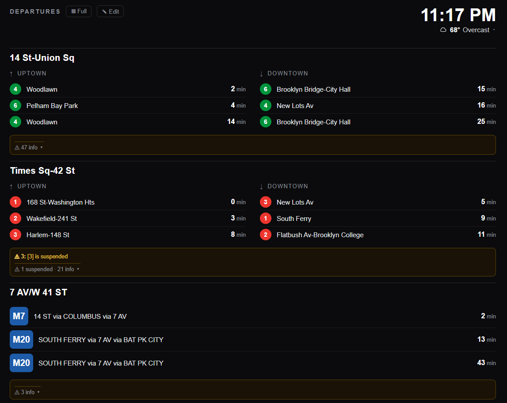
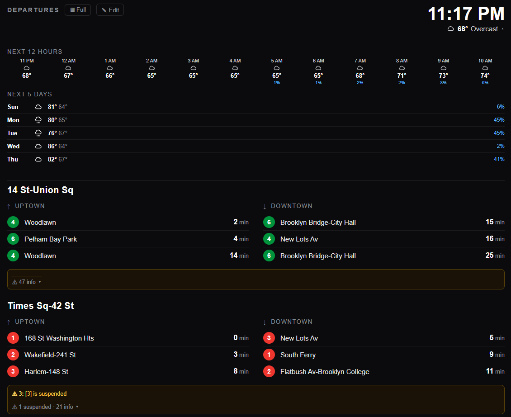

# MTA Display Tracker

A self-hosted **NYC subway departure board** for one or more home stations — built to run
on a Raspberry Pi Zero 2 W in Docker, but it runs anywhere Node + Docker do.

It pulls the **public MTA GTFS-realtime feeds** (no API key required for subway), **MTA Bus
Time** (SIRI; needs a free key) for buses, and **Open-Meteo** weather (no key), and serves a
clean, dark, glanceable board: live arrival countdowns, service alerts, colored line bullets,
a clock, and current weather. The backend exposes a small renderer-agnostic JSON API, so the
React board is just one possible front end.



Click the weather in the top bar to expand a full-width forecast (next 12 hours + 5 days):



## Features

- 🚇 **Live subway arrivals** for any station(s), split into Uptown / Downtown with minute countdowns.
- 🚌 **Live bus arrivals** (MTA Bus Time) for any stop(s) — a single soonest-first list per stop, with "approaching / N stops away" when there's no ETA.
- 🏙️ **Multiple stations/stops** at once, rendered as stacked sections.
- 🔎 **Add stations from the app** — an Edit mode lets you search a station by name and add it (no IDs), then pick from auto-suggested **nearby bus stops**. The list is saved on the server and shared by every display.
- ⚠️ **Service alerts** per station, with severity (delay / suspended / info) inferred from the feed. They start minimized (severe alerts + a count summary) and expand on click.
- 🎨 **Official line bullets** (correct MTA colors) for quick scanning.
- 🌤️ **Weather + clock** in a shared top bar — a condition icon with the current temp; click it to expand a **full-width forecast** (next 12 hours + next 5 days, with precip chance) styled like the departure tables.
- 🖥️ **Kiosk or phone** layouts via a single `DISPLAY_MODE` flag (responsive either way).
- 🧱 **Resilient**: failed feed fetches keep the last-good data and show a "stale" indicator instead of blanking; per-feed isolation; fetch timeouts.
- 🐳 **Dockerized**: multi-stage build, non-root runtime, healthcheck, `restart: unless-stopped`.
- 🗽 **All 496 subway stations bundled** — pick any stop as a home station.

## Quick start (Docker)

```bash
cp .env.example .env       # set WEATHER_LAT/LON, an optional starting STATION, DISPLAY_MODE
docker compose up -d --build
# open http://<host-ip>:8080  → click "Edit" to search & add stations
```

That's it — one container serves both the JSON API and the built web app. You don't have to
get the config perfect up front: `STATION`/`BUS_STOPS` just **seed the first run**, and after
that you manage the board in the app (see [Editing the board](#editing-the-board)). The list is
persisted in a Docker volume (`mta-data`), so it survives restarts.

## Configuration

All configuration is environment variables (see [`.env.example`](.env.example)):

| Variable | Meaning |
|---|---|
| `STATION` | **First-run seed** for the board — one or more subway GTFS parent stop ids, comma-separated (e.g. `127,R01`). After first run, edit the board in the app. Can be empty (add everything from the UI). |
| `BUS_STOPS` | **First-run seed** for bus stops — MTA bus stop code(s), comma-separated. Requires `MTA_API_KEY`. After first run, add buses via the Edit UI's nearby-stop picker. See [Bus stops](#bus-stops). |
| `DISPLAY_MODE` | `kiosk` (large type for a wall display) \| `phone` \| `auto` |
| `COMPACT` | Default compact view (`true`/`false`) — denser layout, fewer arrivals, severe-only alerts. Overridable per device via `?compact=1`/`?compact=0`. See [Compact view](#compact-view). |
| `WEATHER_LAT` / `WEATHER_LON` | Weather location (Open-Meteo, no key) |
| `FEED_REFRESH_SEC` | Arrival feed poll interval (default `30`) |
| `ALERTS_REFRESH_SEC` | Alerts feed poll interval (default `120` — alerts change slowly) |
| `WEATHER_REFRESH_SEC` | Weather poll interval (default `600`) |
| `STALE_THRESHOLD_SEC` | When to flag arrivals as stale (default `90`) |
| `MTA_API_KEY` | MTA Bus Time API key — required only when `BUS_STOPS` is set (subway needs no key). |
| `PORT` | HTTP port (default `8080`) |

### A note on station "complexes"

The official GTFS models large multi-line complexes as **separate parent stations**. For
example, Times Square is four ids:

| id | lines |
| --- | --- |
| `127` | 1 2 3 |
| `725` | 7 |
| `902` | 42 St Shuttle (S) |
| `R16` | N Q R W |

So to show *all* Times Sq trains, set `STATION=127,725,902,R16`. Most stations are a single
id (e.g. `R01` = Astoria-Ditmars Blvd, J/Z).

## Compact view

Compact mode is built for small or e-ink displays. It:

- shows fewer arrivals per direction (3 instead of 6),
- shows **only severe alerts** (delays / suspensions, capped at 3) plus a one-line
  count summary — the noisy "skip-stop" info notices are collapsed into the count,
- tightens spacing and type for denser, glanceable output.

Set the default with the `COMPACT` env var. Because one server can drive several
displays, any device can **override per-URL**:

- `http://<host>:8080/?compact=1` — force compact (e.g. your e-ink panel)
- `http://<host>:8080/?compact=0` — force full (e.g. a wall monitor)
- no param — use the server's `COMPACT` default

## Editing the board

Click **✎ Edit** in the top bar. While editing you can:

- **Search & add a station** — type a station name (no IDs to look up) and click a result to add it. Searching for a station that's **already on the board** just reopens its nearby-bus list, so you can come back later to add more stops.
- **Add / remove nearby buses** — right after adding a station, a checklist of the **closest bus stops** (with their routes and distance) appears. Click anywhere on a row to toggle it: a green check adds the stop, unchecking removes it. Bus lookups need `MTA_API_KEY`.
- **Remove** — each section shows an **×** to drop it from the board.

Changes are saved on the **server** (`data/board.json`, persisted via the `mta-data` Docker
volume) and shared by every display — edit from your phone and the kiosk/e-ink panel update on
their next refresh. Click **✓ Done** to return to the clean board. (`STATION`/`BUS_STOPS` only
seed the very first run; after that this list is the source of truth.)

## Finding your station id

You usually don't need this anymore — just use the [Edit UI](#editing-the-board). But if you
want to seed `STATION` directly: station ids are GTFS parent stop ids. Every station is bundled in
[`server/src/data/stations.json`](server/src/data/stations.json) (id → name + routes), so you
can grep it for your stop:

```bash
grep -i "ditmars" server/src/data/stations.json   # -> "R01": { "name": "Astoria-Ditmars Blvd", "routes": ["J","Z"] }
```

### Refreshing the bundled data (optional)

The station data is generated from the MTA's official GTFS **static** feed. To refresh it:

1. Download the subway GTFS static zip from <https://www.mta.info/developers> and extract it.
2. Regenerate the two data files:

   ```bash
   cd server
   npx tsx scripts/build-stations.ts /path/to/extracted/gtfs   # -> src/data/stations.json (id -> {name, routes})
   npx tsx scripts/build-stops.ts    /path/to/extracted/gtfs/stops.txt   # -> src/data/stops.json (id -> name, for destinations)
   ```

- **`stations.json`** = every station with its route list; drives which feeds to poll for your `STATION`(s) and alert filtering.
- **`stops.json`** = complete stop-id → name map, used to label arrival **destinations**.

## Bus stops

Buses use **MTA Bus Time** (the SIRI API), which needs a free key:

1. Get a key at <https://bustime.mta.info/wiki/Developers/Index> and set `MTA_API_KEY`.
2. Find your bus stop's **code** — the 6-digit number printed on the bus-stop pole, or look it
   up at <https://bustime.mta.info>. Set `BUS_STOPS` to one or more codes, comma-separated.

```bash
MTA_API_KEY=your-key-here
BUS_STOPS=401687,404923
```

Each bus stop renders as its own section: a single soonest-first list of `route → destination →
minutes` (a bus-stop pole is one direction). When there's no live ETA the row shows the feed's
status instead ("approaching", "N stops away", "at stop"). Bus service alerts come from the same
feed and show under the stop, just like subway alerts. Bus route badges are rounded rectangles
(with an SBS variant) to distinguish them from the round subway bullets.

## API

`GET /api/board` returns the full board as JSON (the renderer-agnostic contract). Each entry in
`stations` has a `type` of `"subway"` (uses `directions`, split N/S) or `"bus"` (uses a flat
`arrivals` list); `arrivals[].minutes` is `null` when there's no ETA, with a `note` string
(e.g. `"approaching"`) instead.

```jsonc
{
  "updatedAt": "2026-06-21T14:02:11.000Z",
  "stale": false,
  "displayMode": "kiosk",
  "weather": {
    "tempF": 79, "condition": "Overcast", "icon": "cloudy",
    "hourly": [{ "time": "2026-06-21T15:00", "tempF": 79, "icon": "cloudy", "precipPct": 10 }],
    "daily":  [{ "date": "2026-06-21", "hiF": 82, "loF": 68, "icon": "cloudy", "precipPct": 20 }]
  },
  "stations": [
    {
      "station": { "id": "127", "name": "Times Sq-42 St" },
      "updatedAt": "2026-06-21T14:02:11.000Z",
      "stale": false,
      "directions": [
        { "direction": "N", "label": "Uptown", "arrivals": [
          { "route": "1", "color": "#ee352e", "textColor": "#ffffff",
            "destination": "Van Cortlandt Park-242 St", "minutes": 2 }
        ]},
        { "direction": "S", "label": "Downtown", "arrivals": [] }
      ],
      "alerts": [
        { "routes": ["2","3"], "severity": "delay", "text": "Southbound 2/3 trains are delayed." }
      ]
    }
  ]
}
```

`GET /api/health` returns `{ "status": "ok" }` (used by the Docker healthcheck).

Board editing (used by the Edit UI):

- `GET /api/stations/search?q=` — subway search → `[{ id, name, routes }]`.
- `GET /api/nearby-buses?stationId=` — nearby bus stops → `[{ code, name, routes, distanceMeters, alreadyAdded }]`.
- `POST /api/board/stations` `{ id, type }` — add a subway station or bus stop.
- `DELETE /api/board/stations` `{ id, type }` — remove one.

## Kiosk display (HDMI)

Point a fullscreen browser at the board, e.g. on a Pi driving a monitor:

```bash
chromium-browser --kiosk --noerrdialogs --disable-infobars http://localhost:8080
```

## Architecture

A single Node process does all the work and the browser just renders small JSON:

```text
┌──────────────────────── Docker (Node + TypeScript) ─────────────────────────┐
│  Arrivals poller  ── fetch station feed(s) every ~30s, decode protobuf,      │
│                       filter to each station (split N/S), cache board model   │
│  Alerts poller    ── fetch the alerts feed every ~120s, filter per station   │
│  Bus poller       ── SIRI StopMonitoring per bus stop (~30s): arrivals+alerts │
│  Weather service  ── fetch Open-Meteo every ~10 min                          │
│  Express          ── GET /api/board (JSON contract) + GET /api/health        │
│                      + serves the built React app                            │
└──────────────────────────────────────────────────────────────────────────────┘
        ▲ browser (kiosk fullscreen or phone) polls /api/board every ~10s
```

- Feeds are fetched **once per cycle** and fanned out to every configured station (no
  duplicate fetches when stations share lines). All fetches have timeouts and per-feed
  isolation; a single bad feed never blanks the board.
- `/api/board` is a pure cache read — no per-request work — and is the contract a future
  renderer (e.g. an LED/e-ink display) could consume instead of the web app.

See [`docs/superpowers/specs/`](docs/superpowers/specs/) and
[`docs/superpowers/plans/`](docs/superpowers/plans/) for the original design + implementation plan.

## Tech stack

- **Backend:** Node.js 20, TypeScript (compiled to CommonJS), Express, `gtfs-realtime-bindings`.
- **Frontend:** React 18 + Vite + TypeScript.
- **Tests:** Vitest (+ Supertest, Testing Library).
- **Container:** multi-stage Docker, `node:20-slim` (arm64/armv7-friendly).

## Development

```bash
# Backend (terminal 1)
cd server && npm install && npm run dev      # http://localhost:8080

# Frontend (terminal 2)
cd web && npm install && npm run dev         # http://localhost:5173 (proxies /api -> :8080)
```

## Tests

```bash
cd server && npm test    # unit + API tests
cd web && npm test       # component + app tests
```

## License

MIT
